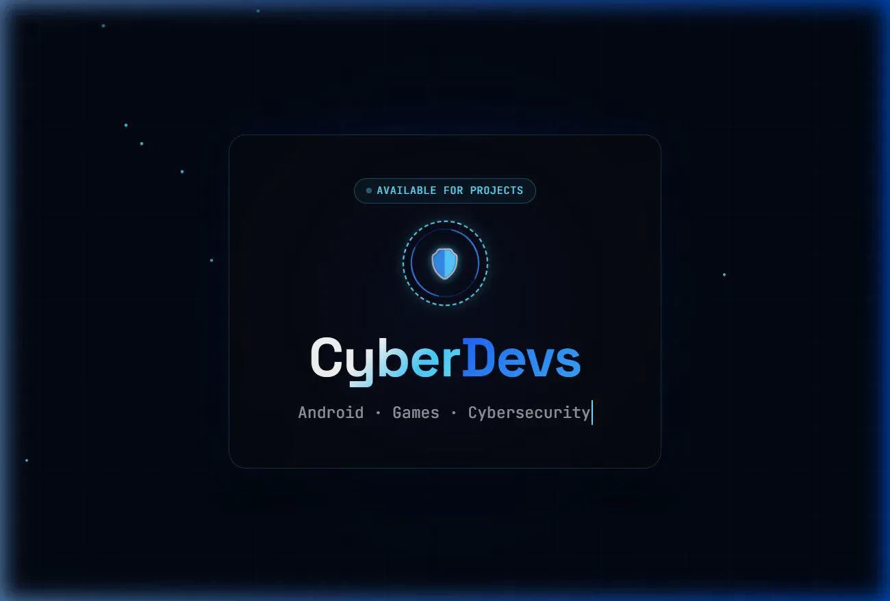
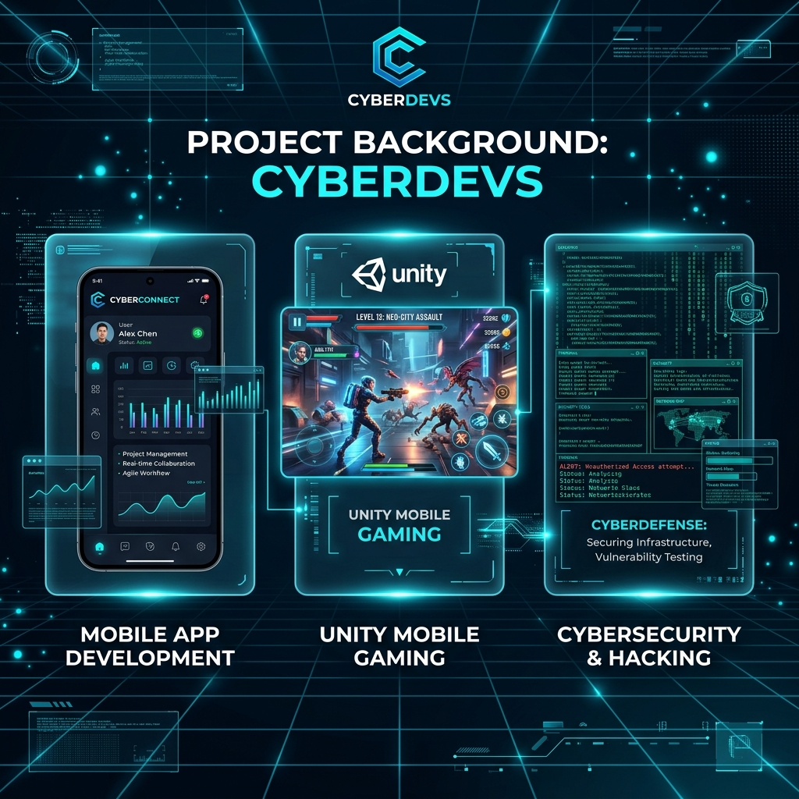

  

 

  <h1>🌌 CyberDevs</h1>
  
<strong>Android Developers · Game Creators · Cybersecurity Experts</strong>

  
📍 Islamabad, Pakistan

  
  &nbsp;&nbsp;
  

---

### About Us 🚀

Welcome to the official GitHub profile of **CyberDevs**. We are a forward-thinking development and security collective specialized in crafting premium digital experiences. From building high-performance Android applications and immersive games to securing infrastructures, we blend innovation with security.

---

### ⚙️ Core Stack & Expertise

<table>
  <tr>
    <td align="center" width="110">
      
       <b>Android</b>
    </td>
    <td align="center" width="110">
      
       <b>Unity 3D</b>
    </td>
    <td align="center" width="110">
      
       <b>Java</b>
    </td>
    <td align="center" width="110">
      
       <b>Kotlin</b>
    </td>
    <td align="center" width="110">
      
       <b>C#</b>
    </td>
  </tr>
  <tr>
    <td align="center" width="110">
      
       <b>Python</b>
    </td>
    <td align="center" width="110">
      
       <b>Kali</b>
    </td>
    <td align="center" width="110">
      
       <b>C++</b>
    </td>
    <td align="center" width="110">
      
       <b>Docker</b>
    </td>
    <td align="center" width="110">
      
       <b>Linux</b>
    </td>
  </tr>
</table>

---

### 🌟 Project Background

  

---

### 📊 Github Stats & Activity

  
<b>📈 View Performance Stats</b>

   
  

    
    
  

  
<b>🔥 View Activity Graph</b>

   
  

    
  

  
<b>👁️ Profile Views & Wakatime</b>

   
  

    
  

